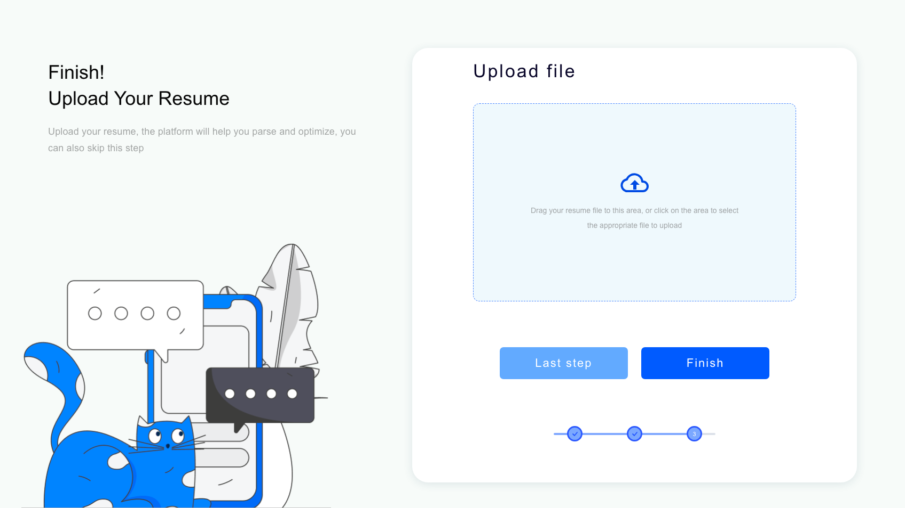
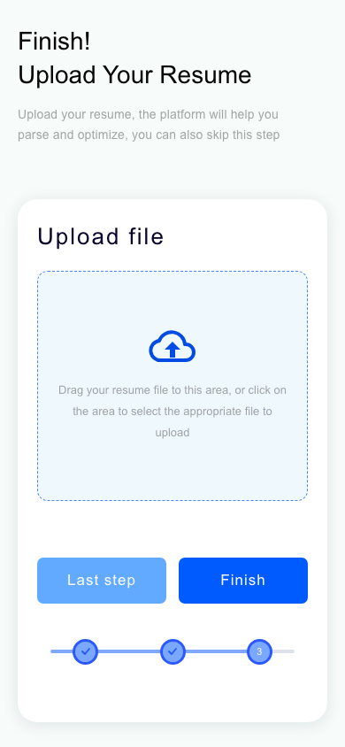

# Resume Upload · 前端笔试

使用 **HTML5、CSS3 和原生 JavaScript** 还原题目中的简历上传页面。Vite 仅用于本地开发和生产打包，无运行时框架依赖。

## 预览



<details>
<summary>查看移动端效果</summary>



</details>

## 运行

环境：Node.js 22.12+ 或 24+。

```bash
npm ci
npm run dev
```

打开终端输出的本地地址。

```bash
npm run build     # 构建到 dist/
npm run preview   # 预览生产构建
```

本项目也可直接部署到普通静态 HTTP 服务器：`index.html`、`src/`、`assets/` 即可运行。请通过 HTTP 访问；不使用 `file://` 打开 ES module。

## 已实现

- 桌面端双栏布局、左侧插画、白色圆角卡片、阴影、蓝色虚线拖拽区及三步进度条。
- 平板及手机端自动切换上下布局；窄屏隐藏装饰插画，优先显示上传操作。
- 点击上传区打开原生文件选择框；支持拖拽文件。
- 显示文件名、大小；支持替换、移除及重复选择同一文件。
- 支持 PDF / DOC / DOCX，限制单个文件且不超过 10 MB；空文件、格式错误及超限时显示提示。
- 按钮 hover / active / focus-visible 状态；支持键盘、屏幕阅读器状态提示及减少动画偏好。
- `Finish` 支持带文件完成或跳过上传；显示结果弹窗。
- `Last step` 显示上一页范围说明，保留已选文件。题目未提供前两步设计，因此没有虚构额外业务表单或依赖浏览器历史跳转。

**范围说明：**这是前端交互实现，没有上传接口。选中的文件只保留在当前页面内存中，刷新即清除，不发送至服务器，也不执行简历解析。前端扩展名及大小校验用于交互提示；接入真实服务时仍需服务端验证。

## 验证

```bash
npx playwright install chromium
npm test
```

Playwright 在桌面端（1695 × 954）和移动端（390 × 664）分别执行 9 项场景，共 18 项：布局、文件选择/移除/重选、拖拽、格式/空文件/大小校验、多文件拒绝、完成/跳过、上一页反馈以及键盘操作。另检查 320–1920 px 多个宽度无横向溢出。移动端截图使用 390 × 844。

## 文件结构

```text
index.html               语义化页面结构
src/styles.css           样式和响应式断点
src/main.js              文件交互与弹窗逻辑
assets/                  插画与 SVG 图标
tests/upload.spec.js     浏览器交互测试
docs/                    桌面和手机效果截图
```

插画从题目提供的设计截图中裁取，仅用于本次页面还原；未包含截图中的批注、灰色外框及题目说明。云上传与步骤图标为内联 SVG。没有引入远程字体、图片或第三方运行时请求。
